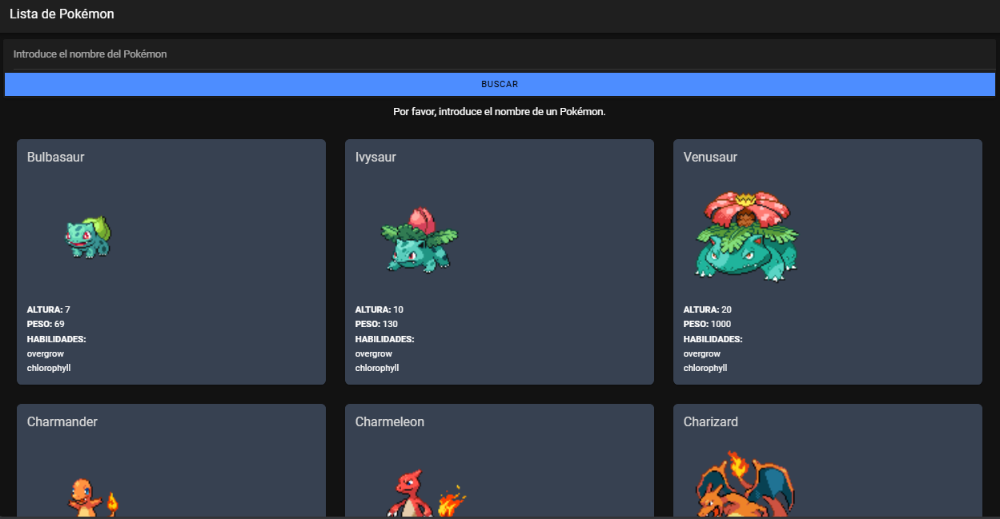
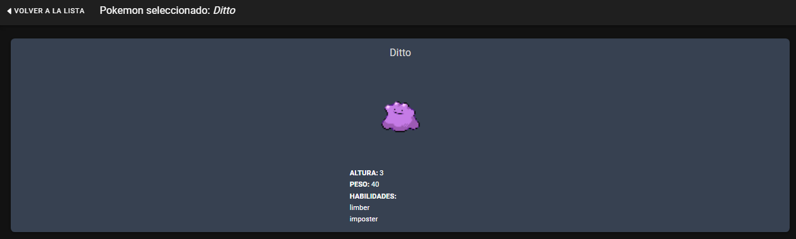
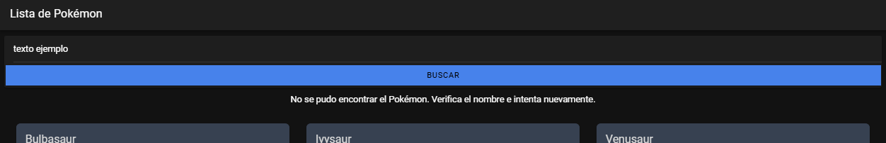
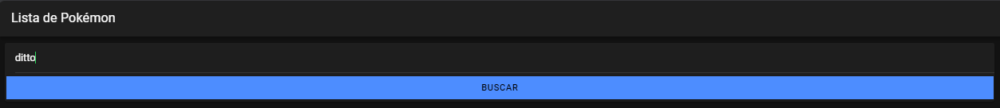

<h1>pokeAPI-Ionic</h1>

<h2>Integrantes</h2>
<ol>
  <li>Daniel Cola</li>
  <li>Marcelo Pinzón</li>
  <li>Silvia Chaluisa</li>
</ol>

<ul>
  <li>
    <h2>Descripcion</h2>
    
La aplicación consiste en una lista de pokemones, donde 
    se puede ver la información de cada uno de ellos, como su
    nombre, habilidades. Además, se puede buscar un
    pokemon en específico por su nombre.

  </li>
  <li>
    <h2>Capturas del funcionamiento</h2>
    

      
      

        En esta pantalla se muestra una lista de pokemones,
        donde se puede ver el nombre de cada uno de ellos y
        al dar clic en uno de ellos se puede ver la información
        detallada del pokemon.
      

    

    

      
      

        En esta pantalla se muestra la información detallada
        de un pokemon en específico, como su nombre, habilidades.
      

       
    

    

      
      

        Se muestra la validacion y busqueda de un pokemon en
        específico por su nombre.
      

      
      

        Se muestra el campo con un valor ejemplo de la
        busqueda de un pokemon.
      

    

  </li>
</ul>
